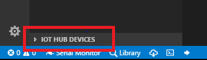
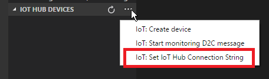
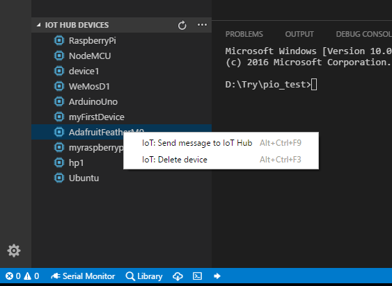
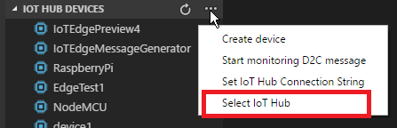
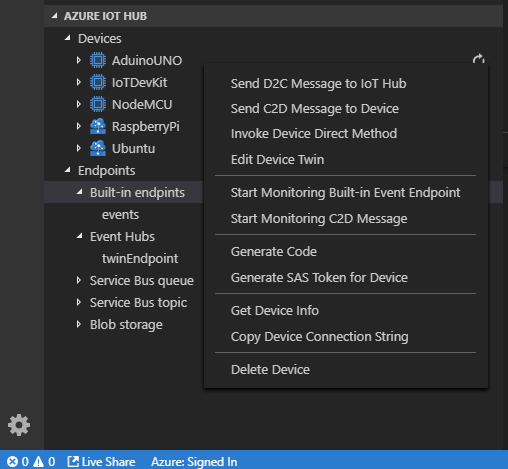
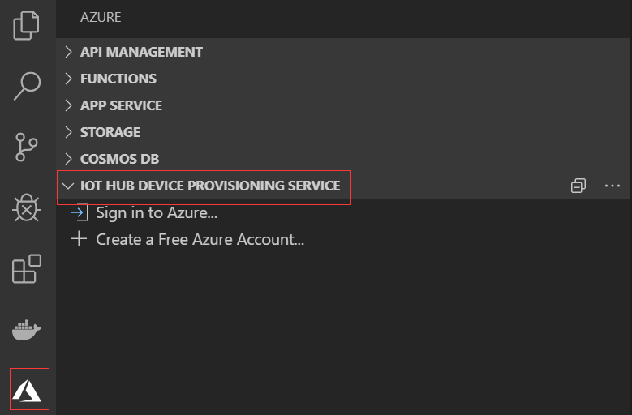
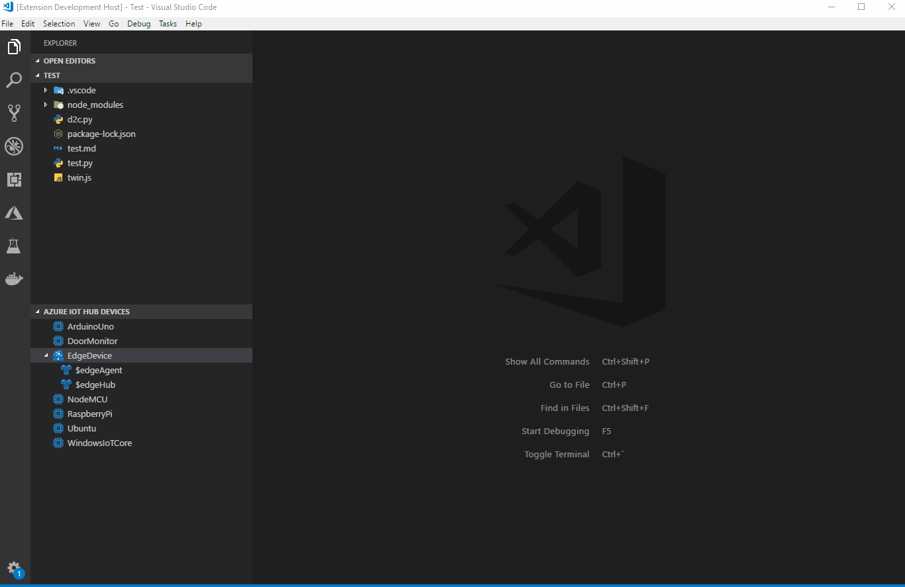
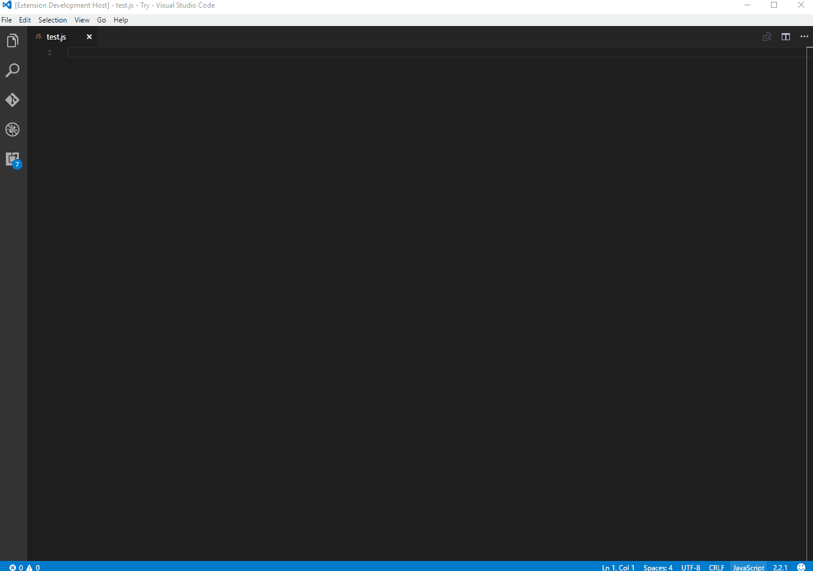

# Azure IoT Hub

[](https://gitter.im/Microsoft/azure-iot-toolkit?utm_source=badge&utm_medium=badge&utm_campaign=pr-badge&utm_content=badge) [](https://marketplace.visualstudio.com/items?itemName=vsciot-vscode.azure-iot-toolkit)

## Overview

Interact with Azure IoT Hub, IoT Device Management, IoT Edge Management, IoT Hub Device Simulation, IoT Hub Code Generation and IoT Hub Device Provisioning Service.

## Device Explorer
The [Wiki page](https://github.com/Microsoft/vscode-azure-iot-toolkit/wiki) includes a comprehensive getting started guide as well as  detailed usage instructions of the following features:

* IoT Hub management
    * Create IoT Hub
    * Select IoT Hub
    * Copy IoT Hub Connection String
    * Generate SAS Token for IoT Hub
* Device management
    * List devices
    * Get device info
    * Create IoT device
    * Create Edge device
    * Delete device
    * Copy Device Connection String
    * Generate SAS Token for Device
* Module management
    * List Modules
    * Get Module Info
    * Create Module
    * Edit Module Twin
    * Invoke Module Direct Method
    * Copy Module Connection String
    * Delete Module
* Interact with Azure IoT Hub
    * Generate Code for C#, F#, Go, Java, Node.js, PHP, Python, Ruby or REST API
    * Send D2C message to IoT Hub
    * Monitor Built-in Event Endpoint
    * Send C2D message to device
    * Receive C2D message from IoT Hub
    * Invoke Device Direct Method
    * Edit Device Twin
    * Manage Azure IoT distributed tracing
* Interact with Azure IoT Edge (Install [Azure IoT Edge](https://marketplace.visualstudio.com/items?itemName=vsciot-vscode.azure-iot-edge) for more IoT Edge support)
    * List Modules 
    * Edit Module Twin
    * Create deployment for Single Device
    * Create Deployment at Scale
* Endpoints management
    * List Built-in and Custom Endpoints
    * Monitor Custom Event Hub Endpoint

### Prerequisites

1. In Explorer of VS Code, click "Azure IoT Hub" in the bottom left corner.

  

2. Click "Set IoT Hub Connection String" in context menu.

  

3. An input box will pop up, then enter your IoT Hub Connection String (It is one-time configuration, and please make sure it is **IoT Hub Connection String** not **Device Connection String**. The format is `HostName=<my-hub>.azure-devices.net;SharedAccessKeyName=<my-policy>;SharedAccessKey=<my-policy-key>`).

  

4. The devices list will be shown.

  

### Sign in to Azure

Instead of copying and pasting to set IoT Hub Connection String, you could sign in to Azure to select IoT Hub from your Azure Subscription.

1. Click "Select IoT Hub" in context menu.

  

2. If you have not signed in to Azure, a pop-up will show to let you sign in to Azure.
3. After you sign in, your Azure Subscription list will be shown, then select an Azure Subscription.
4. Your IoT Hub list will be shown, then select an IoT Hub.
5. The devices and endpoints list will be shown.

  

## Device Provisioning Service Explorer

1. Open "Azure" view on the Activity Bar, and expand "IOT HUB DEVICE PROVISIONING SERVICE".



2. If you're not signed in, click "Sign in to Azure..." to sign in.

3. Expand one subscription to start exploring your device provisioning services.


## Code Generation



## Code Snippets

| Trigger | Content |
| ---- | ---- |
| iotSendD2CMessage | Send D2C message to IoT Hub |
| iotMonitorD2CMessage | Monitor D2C message for IoT Hub |
| iotSendC2DMessage | Send C2D message to device |
| iotMonitorC2DMessage | Monitor C2D message from IoT Hub |
| iotCallDirectMethods | Send direct methods to device |
| iotReceiveDirectMethods | Receive direct methods from IoT Hub |



> After code snippet is created, you need to install corresponding npm package (e.g. [azure-iot-device-mqtt](https://www.npmjs.com/package/azure-iot-device-mqtt)) to run the code snippet.
> If you want to 'Run Code' directly, you need to install [Code Runner](https://marketplace.visualstudio.com/items?itemName=formulahendry.code-runner).

## Configuration

IoT Hub Consumer Group (default is `"$Default"`):
```json
{
    "azure-iot-toolkit.iotHubConsumerGroup": "$Default"
}
```

The time span (in minutes) of monitoring D2C message before current time (default is `0`):
```json
{
    "azure-iot-toolkit.monitorD2CBeforeNowInMinutes": 0
}
```

Whether to show verbose info when monitoring messages (default is `false`):
```json
{
    "azure-iot-toolkit.showVerboseMessage": false
}
```

Whether to stringify device-to-cloud messages (default is `false`):
```json
{ 
    "azure-iot-toolkit.iotHubD2CMessageStringify": false
}
```

Whether to show IoT Hub info when IoT Hub Connection String is not set (default is `true`):
```json
{ 
    "azure-iot-toolkit.showIoTHubInfo": true
}
```

Whether to enable auto refresh of tree view (default is `false`):
```json
{ 
    "azure-iot-toolkit.treeViewAutoRefreshEnable": false
}
```

Time interval in seconds for tree view auto refresh, auto refresh has to be enabled for it to work. (default is `60`):
```json
{ 
    "azure-iot-toolkit.treeViewAutoRefreshIntervalInSeconds": 60
}
```

## Resources
- [Channel 9 video: Walkthrough of Azure IoT Hub extension](https://channel9.msdn.com/Shows/Internet-of-Things-Show/Azure-IoT-Toolkit-extension-for-Visual-Studio-Code)
- [Channel 9 video: What's new in the IoT Hub extension for VS Code](https://channel9.msdn.com/Shows/Internet-of-Things-Show/Whats-new-in-the-IoT-Toolkit-extension-for-VS-Code)
- [Create an IoT hub using the IoT Hub extension for VS Code](https://docs.microsoft.com/en-us/azure/iot-hub/iot-hub-create-use-iot-toolkit)
- [Use Azure IoT Hub extension to send and receive messages between your device and IoT Hub](https://docs.microsoft.com/en-us/azure/iot-hub/iot-hub-vscode-iot-toolkit-cloud-device-messaging)
- [Use Azure IoT Hub extension for device management](https://docs.microsoft.com/en-us/azure/iot-hub/iot-hub-device-management-iot-toolkit)
- [Quickly build your Azure IoT application with Node.js, Python or REST API](https://devblogs.microsoft.com/iotdev/azure-iot-toolkit-1-2-0-quickly-build-your-azure-iot-application-in-vs-code-with-node-js-python-or-rest-api/)
- [Azure IoT Hub extension supports C#, Go, Java, Node.js, PHP, Python and Ruby to develop Azure IoT application in VS Code](https://devblogs.microsoft.com/iotdev/azure-iot-toolkit-supports-c-go-java-node-js-php-python-and-ruby-to-develop-azure-iot-application-in-vs-code/)
- [Use VS Code as IoT Hub Device Simulator](https://blogs.msdn.microsoft.com/iotdev/2018/07/12/use-vs-code-as-iot-hub-device-simulator-say-hello-to-azure-iot-hub-in-5-minutes/)
- [Use VS Code to call Azure IoT Hub REST APIs](https://blogs.msdn.microsoft.com/iotdev/2018/07/19/call-azure-iot-hub-rest-apis-in-vs-code/)
- [Create and control an IoT device connected to an IoT hub (Node.js)](https://github.com/Microsoft/vscode-azure-iot-toolkit/wiki/Quickstart-Node.js)
- [Create and control an IoT device connected to an IoT hub (.NET)](https://github.com/Microsoft/vscode-azure-iot-toolkit/wiki/Quickstart-.NET)
- [Handy Tool When You Develop With Azure IoT](https://blogs.msdn.microsoft.com/iotdev/2017/09/01/handy-tool-when-you-develop-with-azure-iot/)
- [Azure IoT Hub extension for Visual Studio Code generally available for managing Azure IoT Hub and Devices with ease](https://blogs.msdn.microsoft.com/iotdev/2018/06/30/azure-iot-toolkit-for-visual-studio-code-generally-available-for-managing-azure-iot-hub-and-devices-with-ease/)

## ❤️ Contributors

Thanks to all the [contributors](https://github.com/Microsoft/vscode-azure-iot-toolkit/graphs/contributors)!


## Data/Telemetry
This project collects usage data and sends it to Microsoft to help improve our products and services. Read our [privacy statement](http://go.microsoft.com/fwlink/?LinkId=521839) to learn more. 
If you don’t wish to send usage data to Microsoft, you can set the `telemetry.enableTelemetry` setting to `false`. Learn more in our [FAQ](https://code.visualstudio.com/docs/supporting/faq#_how-to-disable-telemetry-reporting).
