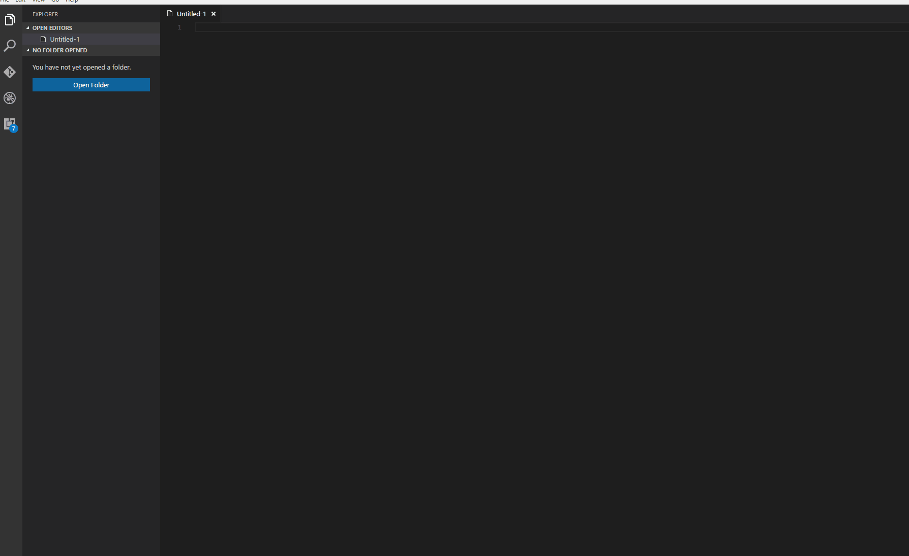
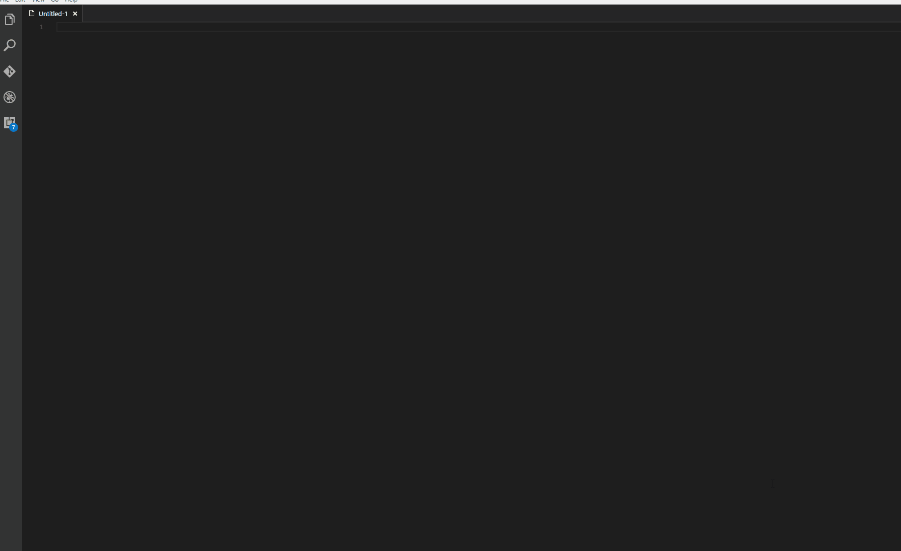
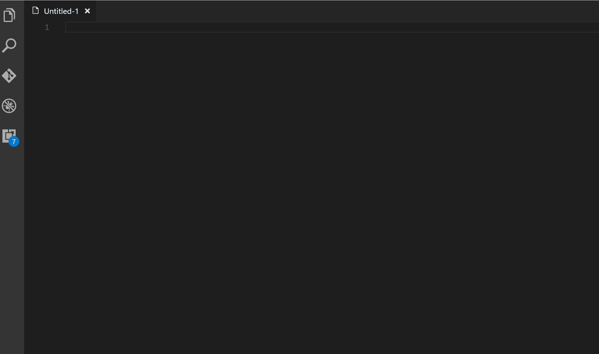
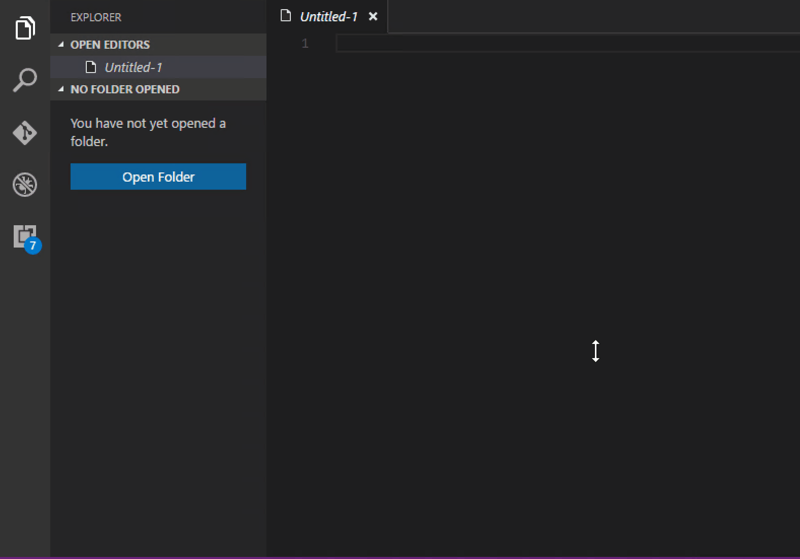
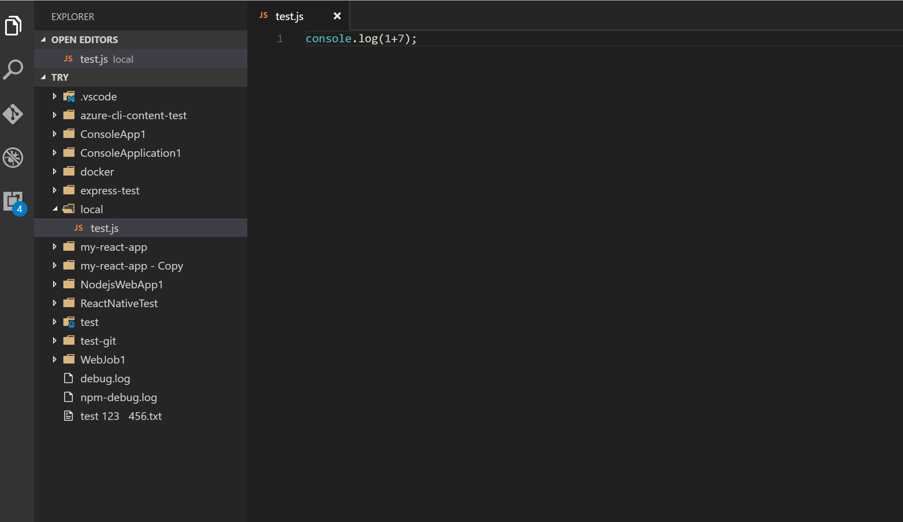
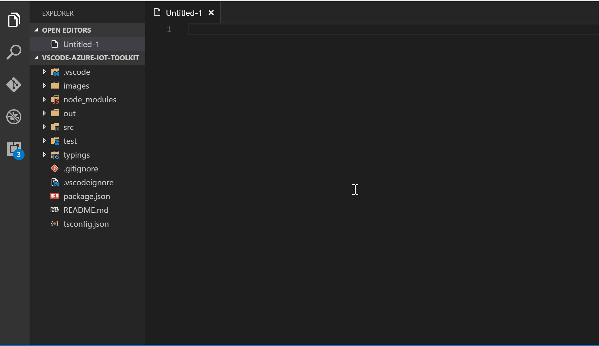

# Azure IoT Toolkit

Toolkit makes Azure IoT Development easier. For more awesome Azure IoT projects and resources, please visit https://aka.ms/azure.iot

## Features

[x] Send messages to Azure IoT Hub (device-to-cloud message)

[x] Monitor device-to-cloud messages

[x] Send messages to Azure Event Hub

[x] Monitor Event Hub messages

[ ] Send messages from Azure IoT Hub to device (cloud-to-device message)

[x] Device management (List, Create, Delete)

[x] Discover devices connected via Ethernet, USB serial and WiFi

[x] Deploy and run in remote machine

[ ] Debug in remote machines

[ ] And more...

## Commands

| Command | Keyboard Shortcuts | Menu Contexts |
| --- | --- | --- |
| Send message to IoT Hub | Ctrl+Alt+F9 | editor/context |
| Start monitoring IoT Hub message | Ctrl+Alt+F10 | editor/context |
| Stop monitoring IoT Hub message | Ctrl+Alt+F11 | editor/context |
| Send message to Event Hub | None | editor/context |
| Start monitoring Event Hub message | None | editor/context |
| Stop monitoring Event Hub message | None | editor/context |
| List device | Ctrl+Alt+F1 | editor/context |
| Create device | Ctrl+Alt+F2 | editor/context |
| Delete device | Ctrl+Alt+F3 | editor/context |
| Discover connected device | Ctrl+Alt+F6 | editor/context |
| Deploy to remote machine | Ctrl+Alt+F4 | None |
| Run in remote machine | Ctrl+Alt+F5 | None |

## Usages

* Send messages to Azure IoT Hub

  

* Monitor device-to-cloud messages

  

* Send/monitor messages for Azure Event Hub

  

* Device management (List, Create, Delete)

  

* Deploy and run in remote machine

  

| Config | description |
| ---- | ---- |
| azure-iot-toolkit.localFolder | The folder of current machine to deploy |
| azure-iot-toolkit.remoteFolder | The folder of remote machine to deploy |
| azure-iot-toolkit.host | The hostname or IP address of remote machine |
| azure-iot-toolkit.username | The username of remote machine |
| azure-iot-toolkit.password | The password of remote machine |
| azure-iot-toolkit.command | The command to run in remote machine |

* Discover Ethernet, USB serial, WiFi devices
  1. Install Node.js or install [device-discovery-cli](https://github.com/Azure/device-discovery-cli):

    ```
    $ npm install --global device-discovery-cli
    ```
  2. Discover devices in VS Code:

  

## Configuration

To set the Device Connection String which is used to send device-to-cloud message:
```json
{
    "azure-iot-toolkit.deviceConnectionString": "HostName=<my-hub>.azure-devices.net;DeviceId=<known-device-id>;SharedAccessKey=<known-device-key>"
}
```

To set the IoT Hub Connection String to monitor device-to-cloud message:
```json
{
    "azure-iot-toolkit.iotHubConnectionString": "HostName=<my-hub>.azure-devices.net;SharedAccessKeyName=<my-policy>;SharedAccessKey=<my-policy-key>"
}
```

To set the IoT Hub Consumer Group (default is "$Default"):
```json
{
    "azure-iot-toolkit.iotHubConsumerGroup": "$Default"
}
```

To set the Event Hub Connection String:
```json
{
    "azure-iot-toolkit.eventHubConnectionString": "{Event Hubs connection string}"
}
```

To set the Event Hub Path:
```json
{
    "azure-iot-toolkit.eventHubPath": "{Event Hub path/name}"
}
```

To set the Event Hub Consumer Group (default is "$Default"):
```json
{
    "azure-iot-toolkit.eventHubConsumerGroup": "$Default"
}
```

## Telemetry data
By default, anonymous telemetry data collection is turned on to understand user behavior to improve this extension. To disable it, update the settings.json as below:
```json
{
    "azure-iot-toolkit.enableAppInsights": false
}
```

## Change Log
See Change Log [here](CHANGELOG.md)

## Issues
Submit the [issues](https://github.com/formulahendry/vscode-azure-iot-toolkit/issues) if you find any bug or have any suggestion.

## Contribution
Fork the [repo](https://github.com/formulahendry/vscode-azure-iot-toolkit) and submit pull requests.